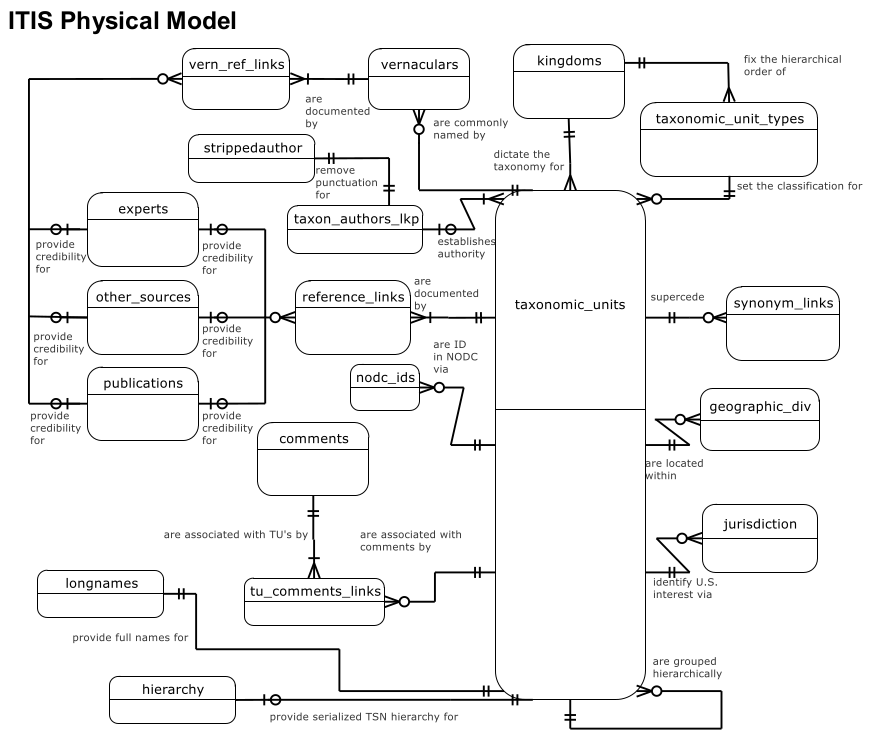

# ITIS

## Conversion

To convert the ITIS database in the `data/` subdirectory to JSON Graph, run

```console
$ python convert_itis_to_jsongraph.py
```

This will produce a `.json` and `.dot` file in the `data/` directory.
The `.dot` file can be converted to PNG using

```console
$ dot -Tpng data/ITIS-042721.dot -o ITIS.png
```

Be careful when opening this file though, as the graph is pretty large. 

## ITIS physical model

The following picture shows the physical model of ITIS
within the source SQLite. Only parts of it are modeled in
the graph.


